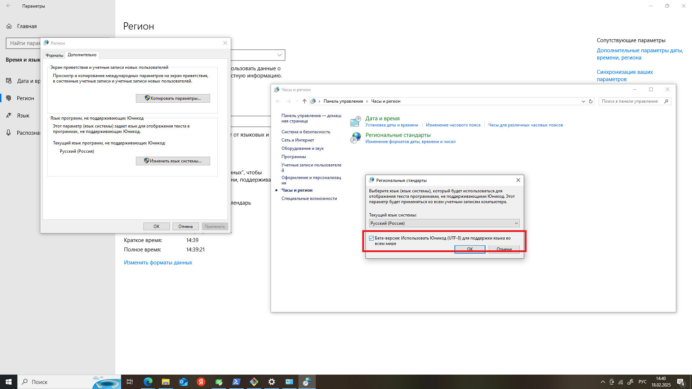
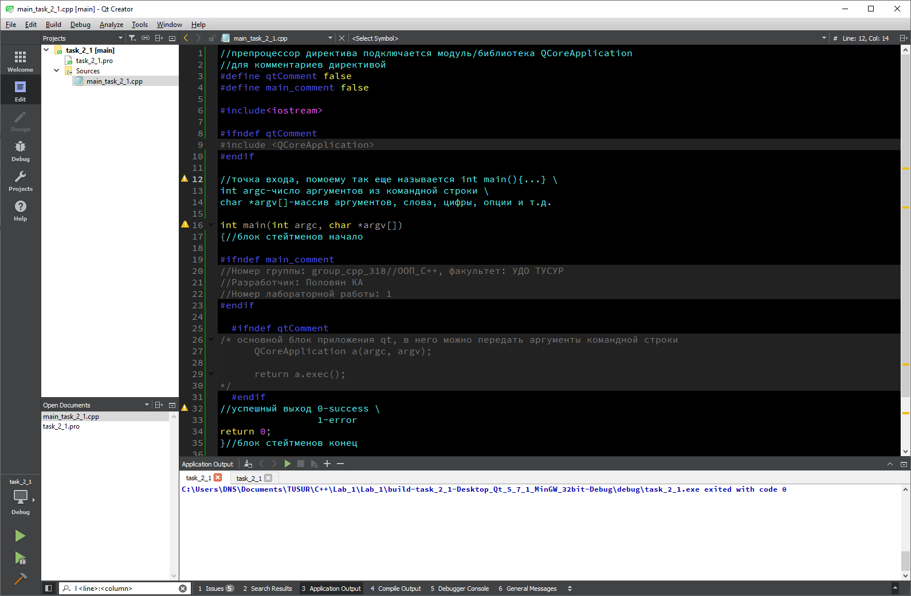
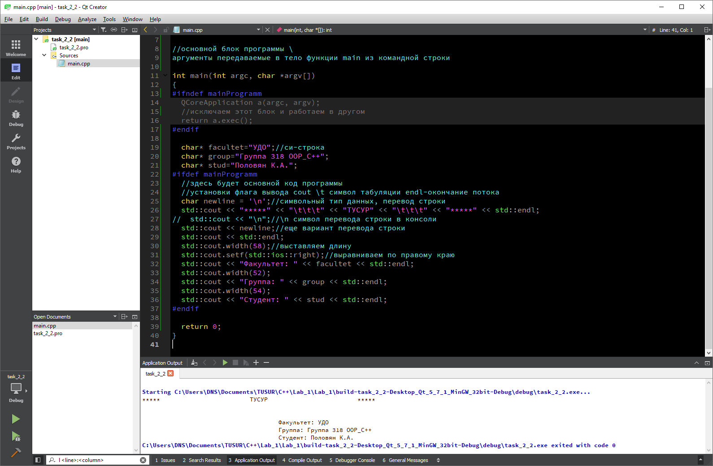
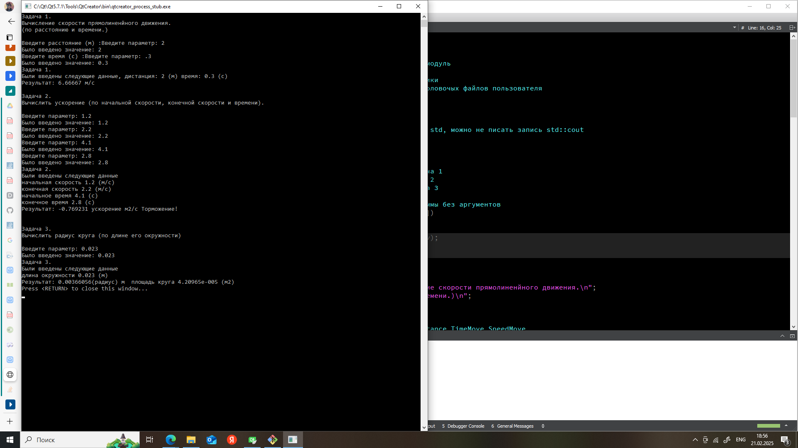

# Progress report.
Лабораторная №1.

## _Тестовое задание_

Скрин экрана (результат выполнения программы).

>Работа выполнялась по методичке, как наглядный пример.
>

>Параметр в Windows 10/Региональные настройки. Выставить флажок - будут русские символы в консоли (в моем случае получилось так).
>Без проблем выводились в консоль русские символы в QDebug()

## _Задание 1_

Скрин экрана к 1 заданию.

>Использование комментариев в программе, директив с комментариями

## _Задание 2_

Скрин экрана к 2 заданию.

>Использование форматированного оператора вывода std::cout

## _Задание 3_

Скрин экрана к 3 заданию.

>Использование оператора ввода std::cin и вывода std::cout, контроль ввода.

