# Laboratory work. Windows console.

> Win+R cmd

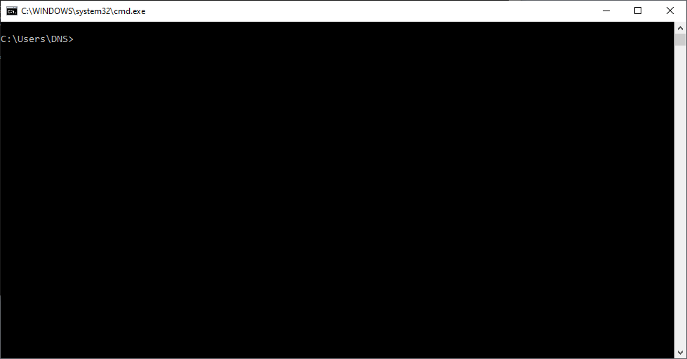

```bash
date
time
```

>Проверка даты и времени. Позволяют проверить и изменить при наличии прав дату и время на хосте.


>Смена директории. Команда pwd показывает в какой папке сейчас находимся.

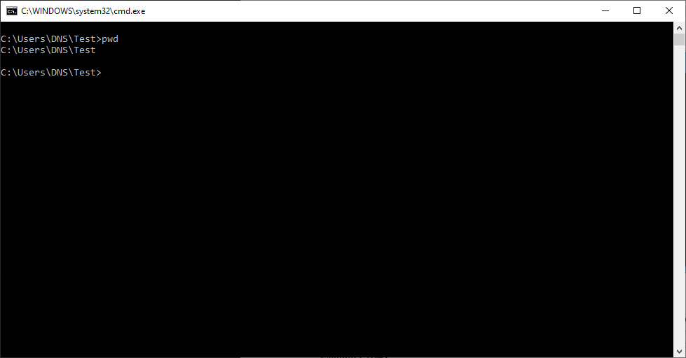

>Создание файла в консоли, редактирование и запись. Для завершения редактирования ctrl+z.

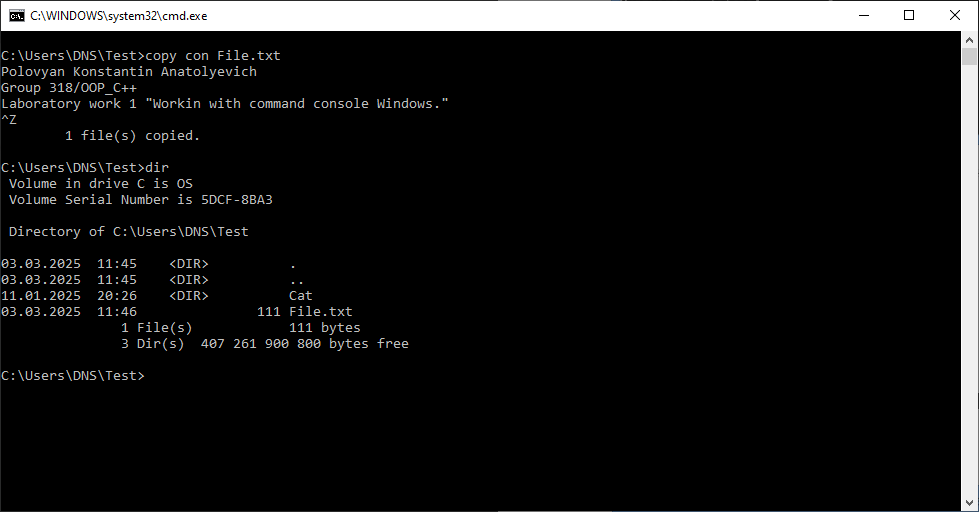

```bash
copy con File.txt
dir
```

>Копирование файла File.txt в каталог Cat с именами File1.txt File2.txt. Объединение скопрированных файлов File1.txt и File2.txt в oneFile.txt Перемещение файла oneFile.txt в папку Test.

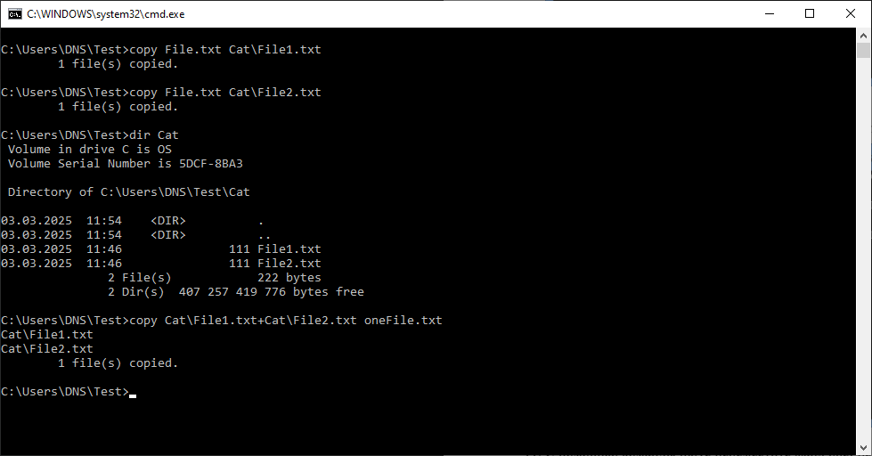
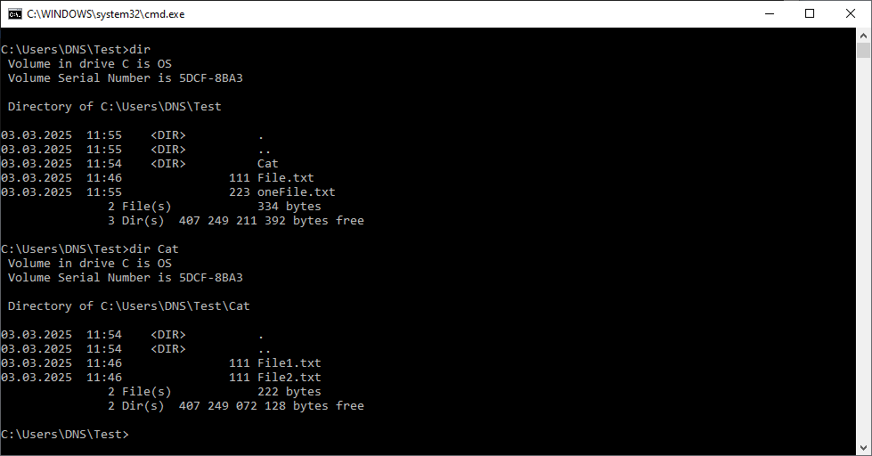
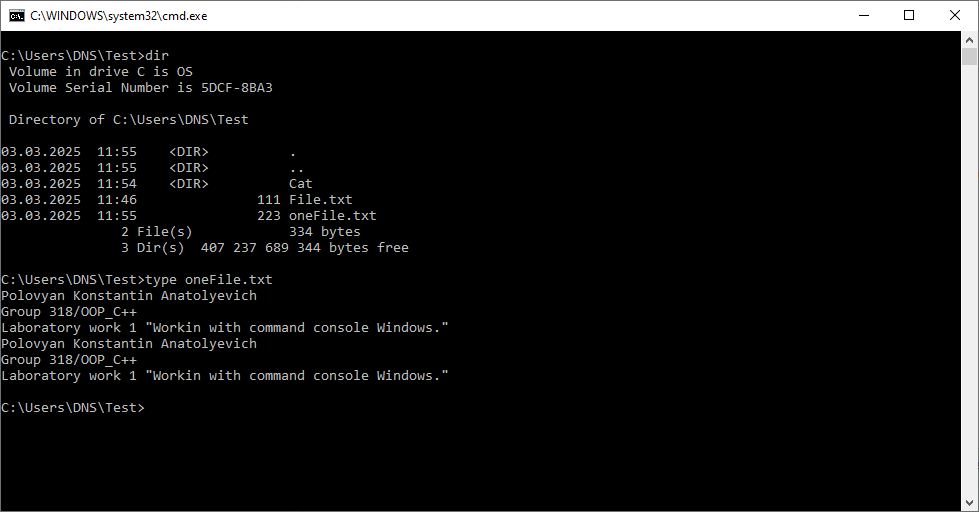

```bash
copy File.txt Cat\File1.txt
copy File.txt Cat\File2.txt
copy Cat\File1.txt+Cat\File2.txt Cat\oneFile.txt
move Cat\oneFile.txt oneFile.txt
type oneFile.txt
dir
```

>Переименование файлов и расширений командой rename.

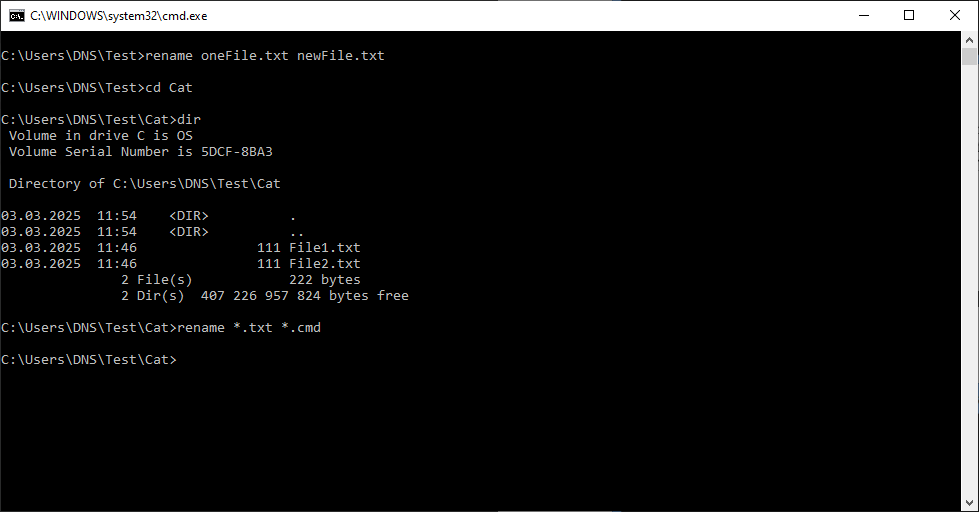


```bash
rename oneFile.txt newFile.txt
cd Cat
rename *.txt *.cmd
dir
dir Cat
rename newFile.txt oneFile.txt
cd Cat
rename *.cmd *.txt
```

>Создание каталогов и подкаталогов. Команда tree для отображения дерева каталогов.

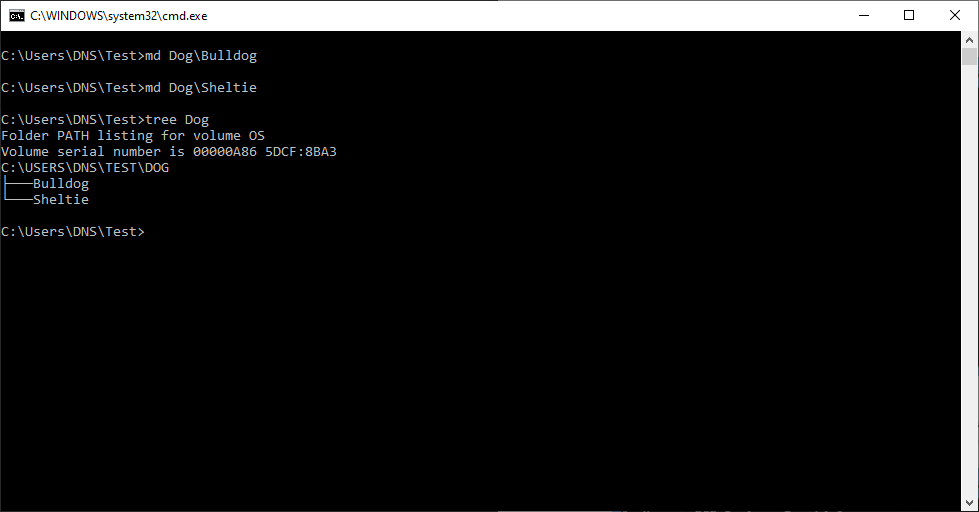
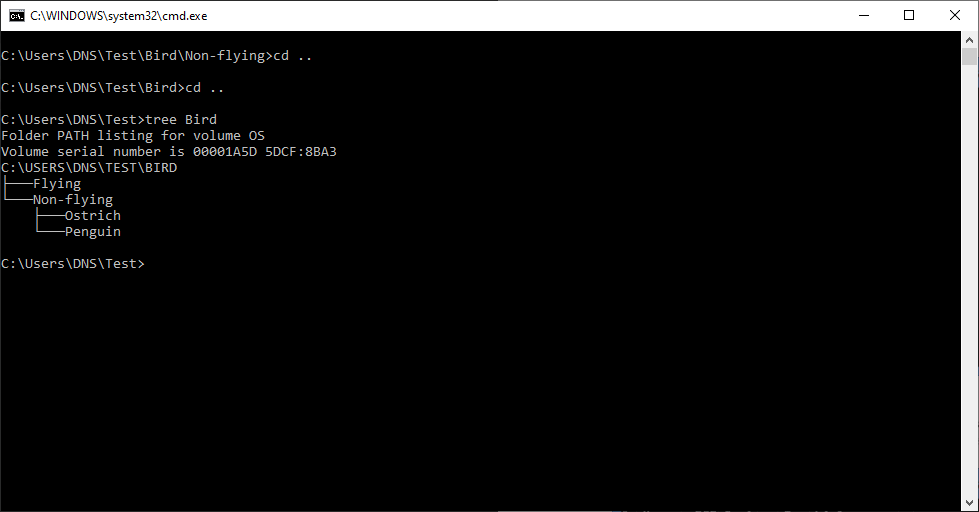
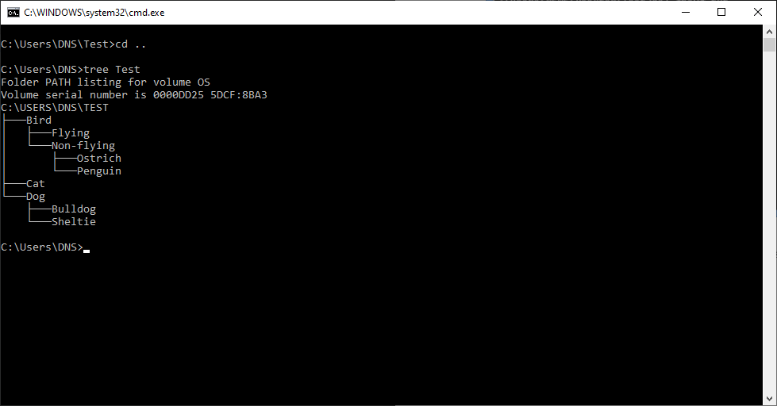

```bash
md Dog\Bulldog
md Dog\Sheltie
tree Dog
md Bird\Flying
md Bird\Non-flying
cd Bird\Non-flying
md Ostrich
md Penguin
tree Test
```

>Удаление файлов командой del и удаление каталогов командой rd.

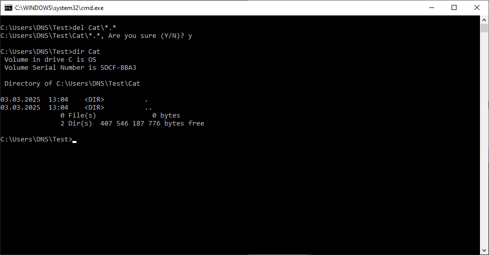
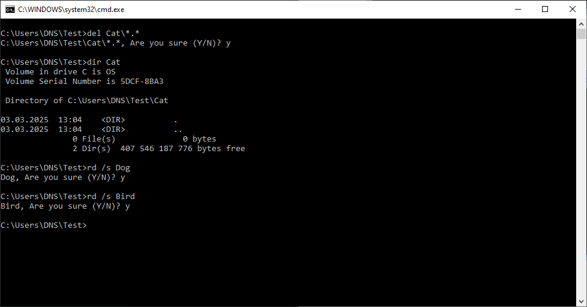
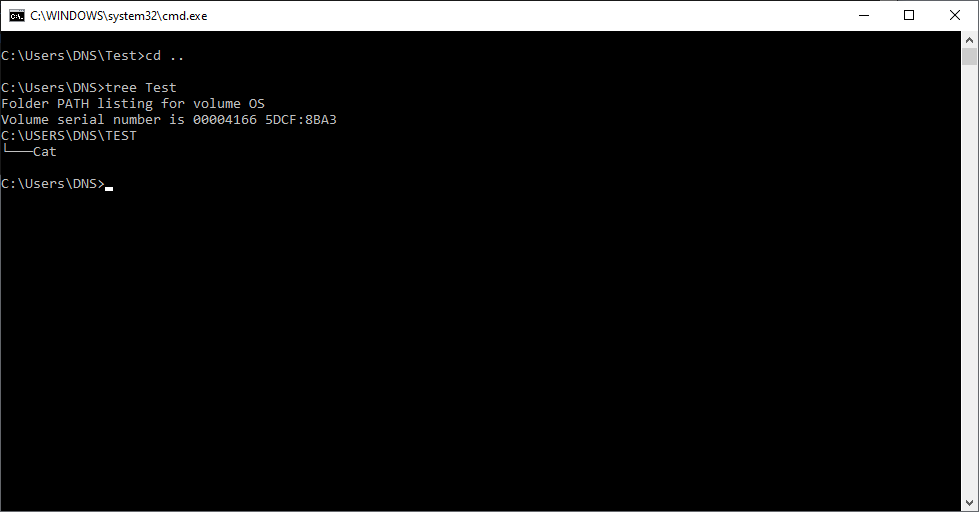

```bash
del Cat\*.*
rd /s Dog
rd /s Bird
tree Test
```

------------------------------------------------------------------------------------------

## Утилиты ipconfig, ping, tracert, arp

### ipconfig

>Работа с сетевыми утилитами в консоли.

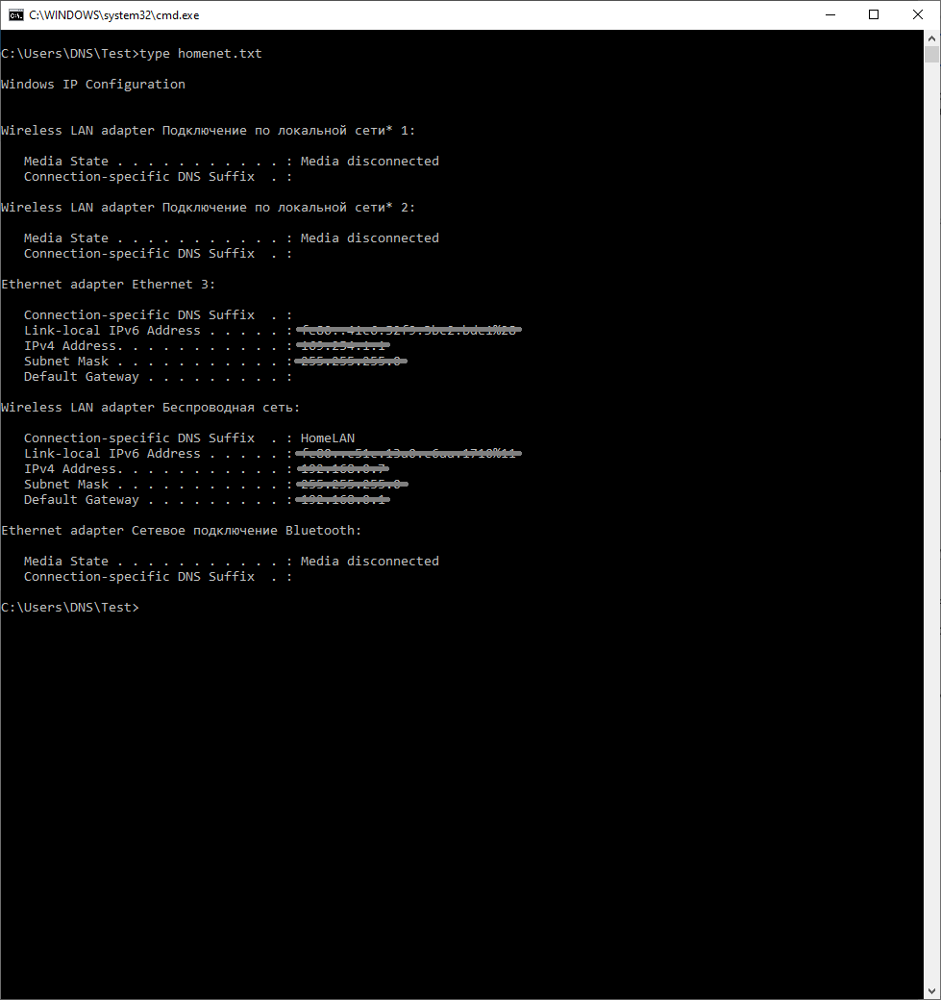

```bash
ipconfig > homenet.txt
```

```bash
#Wireless LAN adapter Беспроводная сеть:                                   #действующее соединение, беспроводное сетевое соединение
#Description . . . . . . . . . . . : Intel(R) Dual Band Wireless-AC 8260   #адаптер
#Physical Address. . . . . . . . . : 5X-0X-DX-4X-6X-6X                     #MAC адрес
#Link-local IPv6 Address . . . . . : fXX0::cXXc:1XX0:cXXa:1XX0%1X          #сетевой адрес IPv6, IPv4
#IPv4 Address. . . . . . . . . . . : 1XX.1XX.X.X(Preferred)                #IPv4
#Subnet Mask . . . . . . . . . . . : 2XX.2XX.2XX.Y                         #маска
#Default Gateway . . . . . . . . . : 1XX.1XX.XX.XX                         #основной шлюз
#DNS Servers . . . . . . . . . . . : 1XX.1XX.XX.XX                         #DNS Server
#DHCP Server . . . . . . . . . . . : 1XX.1XX.XX.XX                         #DHCP
```

### ping

```bash
ping <IPv4-address> #ip host
ping <IPv4-address> -n 21 #16 последняя цифра из имени ПК DESKTOP-HNV16 + 5, ip dns
ping www.ya.ru -n 21
```

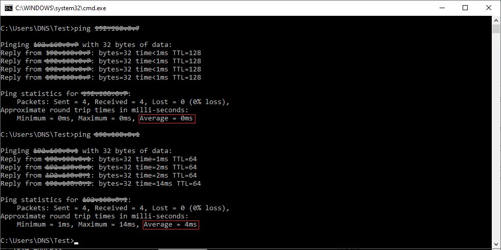

>Среднее время "пингования" адресов 0 ms, потери 0% 
```bash
ping <IPv4 host>
```

```bash
# Pinging 1XX.1YY.Z.Z with 32 bytes of data:
# Reply from 1XX.1YY.Z.Z: bytes=32 time=2ms TTL=64
# Reply from 1XX.1YY.Z.Z: bytes=32 time=2ms TTL=64
# Reply from 1XX.1YY.Z.Z: bytes=32 time=28ms TTL=64
# Reply from 1XX.1YY.Z.Z: bytes=32 time=17ms TTL=64
# Reply from 1XX.1YY.Z.Z: bytes=32 time=3ms TTL=64
# Reply from 1XX.1YY.Z.Z: bytes=32 time=2ms TTL=64
# Reply from 1XX.1YY.Z.Z: bytes=32 time=3ms TTL=64
# Reply from 1XX.1YY.Z.Z: bytes=32 time=6ms TTL=64
# Reply from 1XX.1YY.Z.Z: bytes=32 time=18ms TTL=64
# Reply from 1XX.1YY.Z.Z: bytes=32 time=3ms TTL=64
# Reply from 1XX.1YY.Z.Z: bytes=32 time=3ms TTL=64
# Reply from 1XX.1YY.Z.Z: bytes=32 time=11ms TTL=64
# Reply from 1XX.1YY.Z.Z: bytes=32 time=2ms TTL=64
# Reply from 1XX.1YY.Z.Z: bytes=32 time=2ms TTL=64
# Reply from 1XX.1YY.Z.Z: bytes=32 time=10ms TTL=64
# Reply from 1XX.1YY.Z.Z: bytes=32 time=9ms TTL=64
# Reply from 1XX.1YY.Z.Z: bytes=32 time=5ms TTL=64
# Reply from 1XX.1YY.Z.Z: bytes=32 time=3ms TTL=64
# Reply from 1XX.1YY.Z.Z: bytes=32 time=3ms TTL=64
# Reply from 1XX.1YY.Z.Z: bytes=32 time=2ms TTL=64
# Reply from 1XX.1YY.Z.Z: bytes=32 time=3ms TTL=64

# Ping statistics for 1XX.1YY.Z.Z:
#     Packets: Sent = 21, Received = 21, Lost = 0 (0% loss),
# Approximate round trip times in milli-seconds:
#     Minimum = 2ms, Maximum = 28ms, Average = 6ms
```

>Среднее время "пингования" DNS 4 ms, потери 0%
```bash
ping <IPv4 DNS>
```

```bash
# Pinging ya.ru [77.88.44.242] with 32 bytes of data:
# Reply from 77.88.44.242: bytes=32 time=988ms TTL=58
# Reply from 77.88.44.242: bytes=32 time=345ms TTL=58
# Request timed out.
# Reply from 77.88.44.242: bytes=32 time=224ms TTL=58
# Reply from 77.88.44.242: bytes=32 time=17ms TTL=58
# Reply from 77.88.44.242: bytes=32 time=49ms TTL=58
# Reply from 77.88.44.242: bytes=32 time=84ms TTL=58
# Reply from 77.88.44.242: bytes=32 time=16ms TTL=58
# Reply from 77.88.44.242: bytes=32 time=36ms TTL=58
# Reply from 77.88.44.242: bytes=32 time=229ms TTL=58
# Reply from 77.88.44.242: bytes=32 time=19ms TTL=58
# Reply from 77.88.44.242: bytes=32 time=83ms TTL=58
# Reply from 77.88.44.242: bytes=32 time=691ms TTL=58
# Reply from 77.88.44.242: bytes=32 time=156ms TTL=58
# Reply from 77.88.44.242: bytes=32 time=17ms TTL=58
# Reply from 77.88.44.242: bytes=32 time=64ms TTL=58
# Reply from 77.88.44.242: bytes=32 time=74ms TTL=58
# Reply from 77.88.44.242: bytes=32 time=129ms TTL=58
# Reply from 77.88.44.242: bytes=32 time=386ms TTL=58
# Reply from 77.88.44.242: bytes=32 time=312ms TTL=58
# Reply from 77.88.44.242: bytes=32 time=238ms TTL=58

# Ping statistics for 77.88.44.242:
#     Packets: Sent = 21, Received = 20, Lost = 1 (4% loss),
# Approximate round trip times in milli-seconds:
#     Minimum = 16ms, Maximum = 988ms, Average = 207ms
```

>Среднее время "пингования" www.ya.ru 207 ms, потери 4%
```bash
ping www.ya.ru -n 21
```

### tracert

```bash
tracert www.rsue.ru

#Tracing route to www.rsue.ru [77.95.89.230]
#over a maximum of 30 hops:
#
#  1     1 ms     1 ms     1 ms  RT-GM-3 [1XX.1XX.X.X]
#  2   169 ms    25 ms     *     spbr-bras33.sz.ip.rostelecom.ru [212.48.195.244]
#  3     6 ms     6 ms     6 ms  xe-2-0-3-10g.t1600-2-mmt.nwtelecom.ru [212.48.194.134]
#  4     7 ms     8 ms     9 ms  185.140.148.19
#  5    47 ms    50 ms    42 ms  95.167.212.166
#  6    51 ms    55 ms    54 ms  pe04.Rostov.gldn.net [79.104.233.203]
#  7    51 ms    51 ms    51 ms  Speklis-lgw.Rostov.gldn.net [195.239.127.226]
#  8    51 ms    50 ms    56 ms  77.95.89.230
#
```

>Все IP адреса до www.rsue.ru (77.95.89.230)

hop  |  IP
-----|----------------
1    | 1XX.1XX.X.X DNS
2    | 212.48.195.244
3    | 212.48.194.134
4    | 185.140.148.19
5    | 95.167.212.166
6    | 79.104.233.203
7    | 195.239.127.226
8    | 77.95.89.230

```bash
tracert ww.ya.ru
```

```
#Tracing route to any.yandex.ru [213.180.204.242]
#over a maximum of 30 hops:
#
#  1     3 ms     1 ms     1 ms  RT-GM-3 [1XX.1XX.XX.XX]
#  2    89 ms     5 ms     6 ms  spbr-bras33.sz.ip.rostelecom.ru [212.48.195.244]
#  3     6 ms     5 ms    10 ms  xe-2-0-3-10g.t1600-2-mmt.nwtelecom.ru [212.48.194.134]
#  4     7 ms     8 ms     5 ms  217.107.120.177
#  5    15 ms     5 ms     5 ms  94.25.40.122
#  6     *        *        *     Request timed out.
#  7    20 ms    20 ms    23 ms  any.yandex.ru [213.180.204.242]
#
#Trace complete.
```

>Все IP адреса до any.yandex.ru (213.180.204.242)

hop  |  IP
-----|----------------
1    | 1XX.1XX.X.X DNS
2    | 212.48.195.244
3    | 212.48.194.134
4    | 217.107.120.177
5    | 94.25.40.122
6    | 213.180.204.242

```bash
tracert -d ww.ya.ru
```

```
#Tracing route to any.yandex.ru [213.180.204.242]
#over a maximum of 30 hops:
#
#
#  1     3 ms     6 ms     5 ms  1XX.1XX.XX.XX
#  2     4 ms     5 ms     4 ms  212.48.195.244
#  3    12 ms     6 ms     6 ms  212.48.194.134
#  4     5 ms     6 ms     5 ms  217.107.120.177
#  5     5 ms     6 ms     6 ms  94.25.40.122
#  6     *        *        *     Request timed out.
#  7    19 ms    20 ms    20 ms  213.180.204.242
```
Trace complete.

>Все IP адреса до any.yandex.ru (213.180.204.242) без DNS

hop  |  IP
-----|----------------
1    | 1XX.1XX.X.X DNS
2    | 212.48.195.244
3    | 212.48.194.134
4    | 217.107.120.177
5    | 94.25.40.122
6    | 213.180.204.242

>В 6 пункте превышено время или нет отклика

### arp.

```bash
arp -a -N 1XX.1XX.XX.XX #отображение таблицы ARP на интерфейсе
```

```
Interface: 1XX.1XX.XX.XX --- 0xb
  Internet Address      Physical Address      Type
  1XX.1XX.XX.XX           1X-aX-bX-fX-8X-dX     dynamic
  192.168.0.255         ff-ff-ff-ff-ff-ff     static
  224.0.0.2             01-00-5e-00-00-02     static
  224.0.0.22            01-00-5e-00-00-16     static
  224.0.0.251           01-00-5e-00-00-fb     static
  224.0.0.252           01-00-5e-00-00-fc     static
  239.255.255.250       01-00-5e-7f-ff-fa     static
  255.255.255.255       ff-ff-ff-ff-ff-ff     static
```

IP              | MAC
----------------|-------------------
1XX.1XX.XX.XX   | 1X-aX-bX-fX-8X-dX
192.168.0.255   | ff-ff-ff-ff-ff-ff
224.0.0.2       | 01-00-5e-00-00-02
224.0.0.22      | 01-00-5e-00-00-16
224.0.0.251     | 01-00-5e-00-00-fb
224.0.0.252     | 01-00-5e-00-00-fc
239.255.255.250 | 01-00-5e-7f-ff-fa
255.255.255.255 | ff-ff-ff-ff-ff-ff

```bash
arp -a -N 169.254.1.1
```

```
Interface: 169.254.1.1 --- 0x1c
  Internet Address      Physical Address      Type
  169.254.1.10          00-e0-4c-08-77-f3     dynamic
  169.254.1.255         ff-ff-ff-ff-ff-ff     static
  224.0.0.2             01-00-5e-00-00-02     static
  224.0.0.22            01-00-5e-00-00-16     static
  224.0.0.251           01-00-5e-00-00-fb     static
  224.0.0.252           01-00-5e-00-00-fc     static
  239.255.255.250       01-00-5e-7f-ff-fa     static
```

IP              | MAC
----------------|-------------------
169.254.1.10    | 00-e0-4c-08-77-f3
169.254.1.255   | ff-ff-ff-ff-ff-ff
224.0.0.2       | 01-00-5e-00-00-02
224.0.0.22      | 01-00-5e-00-00-16
224.0.0.251     | 01-00-5e-00-00-fb
224.0.0.252     | 01-00-5e-00-00-fc
239.255.255.250 | 01-00-5e-7f-ff-fa

```bash
arp -a 1XX.1XX.XX.XX
```

```
Interface: 1XX.1XX.XX.XX --- 0xb
  Internet Address      Physical Address      Type
  1XX.1XX.XX.XX           1X-aX-bX-fX-8X-dX     dynamic
```

```bash
arp -d * #полная очистка таблицы
arp -d <192.XXX.X.X> <192.XXX.X.Y> #удаление записи из таблицы для ip-адреса 192.XXX.X.X на сетевом интерфейсе 192.XXX.X.Y
```
